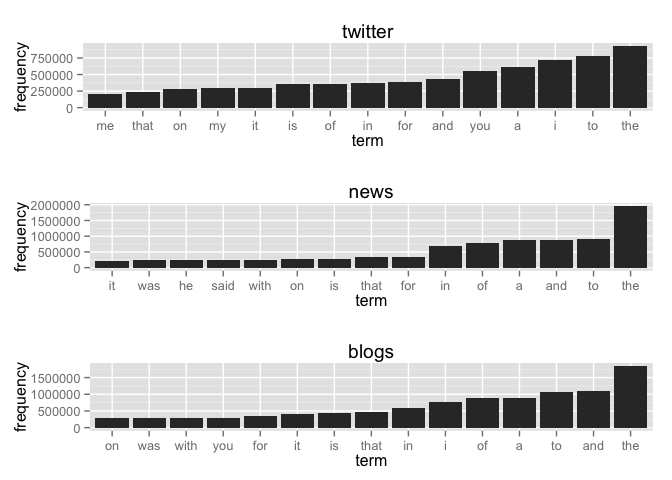
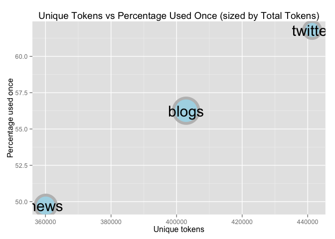

# Milestone
Joe Willage  


This document serves as a milestone report for the NLP final project. The end goal of the project 
is to create an application that predicts the next word entered by the user. This report will 
explain the relevant exploratory analysis of the provided data sets, as well as lay out the plans 
for the final product.  

##Exploratory Analysis

###Corpora Summary  


Before breaking down any text and performing natural language processing, we've explored the texts 
just as they've been provided. We have three sets of text, or corpora, namely: twitter, news, and
blogs. A text is either a single tweet, or news/blog article consisting of one or more sentences. 
Here we see the number of texts in each corpus, along with the mean, median, and max characters per
text.  


```
          Texts Average Median Maximum
twitter 2360148      69     64     140
news    1928657     104     94    3008
blogs    899288     230    156   40833
```

The average length of news and blogs are a bit higher than the medians. This skew is caused by some 
very long texts. The longest text in our corpora is a blog with more than 40 thousand characters. 
Note the 140 character limit on tweets. So when using the full set of data provided, we will be 
working with over 4 million texts. 

###Tokenizing  
The first step in building a predictive language model is **tokenizing**, which involves breaking a
sentence down into individual words (or pairs of words, or triplets of words, etc). These tokens are what we call *n*-grams, where *n* is the number of words. For example, let's take the phrase "the 
cat jumped high". In a 1-gram (uni-gram) model, we would have the following grams: "the", "cat",
"jumped", "high". In a 2-gram (bi-gram) model, we would have: "the cat", "cat jumped", "jumped 
high".  

During the tokenization phase, we've made the decision to filter out whitespace and puncutation,
and covert all text to lowercase. This makes for easier processing down the line, by having a more
uniform set of texts. So different **wordforms** of the same meaning, ie. "I've got", "Ive got", 
"i've got", and "I'VE GOT" (etc) will all end up as the token "ive got".  


After tokenization to uni-grams, we can see the most frequent terms and how often they appear in 
each corpus.  

 

We see the top 15 tokens for twitter, news, and blogs. Most of the top features in all the corpora 
are words that help construct sentences, like "the", "and", "to", "a". In general, these words are 
called "stop words", and are words you would sometimes exclude from further processing, depending on
the application. They don't add much value as far as explaining what's in the text. In this 
instance, we can glean a little insight from them; the inclusion of "you" and "me" highlight how
conversational twitter is. The news seems more objective, with "said", "he", and "was" all in the 
top 15. The blogs corpus appears to be a cross between the other two; containing both "you" and 
"was". Keeping these stop words is an important part of this particular application, word 
prediction. We indeed want to predict "the" and "to" if that's the most likely word to appear next.  

Now we take a look at the *unique* number of uni-grams for each corpus. We can call this the 
vocabulary of each corpus.  


```
twitter    news   blogs 
 441342  360079  402909 
```

While twitter may have the largest vocabulary here, it's important to remember what we're looking 
at. There hasn't been any filtering yet, only tokenization. That means everything with a space on 
both sides is considered a uni-gram here. That includes numbers, @mentions, misspellings, #hashtags,
etc. In fact, of twitter's 441342 terms, only 38% are used
more than once. This plot describes all the corpora:  

 


So initially we may have been surprised to see twitter having the largest vocabulary (while also 
having the smallest data set), but we see that close to 2/3 are only used once. The other two 
corpora also have single-use words over 50%, but we expect to see this graph change once we perform
some basic filtering as mentioned above.

##Future Plans  

###Algorithm  
The prediction model will work by storing frequently seen *n*-grams, and using those to predict the
user's next word. The model depends completely upon the text it was trained upon, ie the 3 provided
datasets. 

Along with the uni-grams we've already processed and explored, we will be creating bi-grams, 
tri-grams, and 4-grams. With each of these *n*-gram datasets, we will perform processing in the same
way. Corpora are handled separately at this point, and will be merged later. Each *n*-gram for each
corpora will have it's frequency calculated. We'll store those results in a new object, which 
contains all of the unique *n*-grams and their frequencies. The twitter bi-gram frequency object 
may look something like this:


```
                 gram       Freq abs
410667   the together 0.00000085   1
405540    the feeding 0.00000085   1
405746      the freak 0.00000171   2
413538      then this 0.00000512   6
408396   the pakistan 0.00000085   1
413753     there back 0.00000085   1
404755        the day 0.00034845 408
411924 their families 0.00000256   3
408225    the on-hold 0.00000085   1
415059    they merely 0.00000085   1
403591       the blog 0.00001623  19
412484   thelma she's 0.00000085   1
407625 the metrocrest 0.00000085   1
406566 the impossible 0.00000683   8
412328   their social 0.00000171   2
```

Then we create indices The index is the *n-1*-gram of an *n*-gram. The index for "the dog", "the 
cat", "the computer" are all "the". Once we have the indices for each entry in the frequency object,
we find the maximum frequency for each index, and discard the other entries So if "the dog" appears
most frequently for the index "the", we get rid of all the other entires for index "the". Now we 
have a basic working model. When a user types in "the", we predict the next word to be "dog".  

However we still need to combine together each of the 3 corpora. At this time, we handle indexes 
that appear in multiple corpora by taking the one with the highest frequency. The choice was made 
to take absolute frequency over relative frequency. So if index/term "the"/"dog" appears in twitter
10 times with 0.00002 frequency, but "the"/"computer" appears in blogs 20 times with 0.00001 
frequency, we take "the"/"computer" for the final model. 

The above steps generate a working *n*-gram model, but our final model combines *n*-grams. We'll be
implementing what's referred to as the "stupid backoff" model to deal with indexes that we haven't 
seen in the training set. This method looks for the index in the highest-order *n*-gram, which is 
a 4-gram in this implementation. If it doesn't find the user's last 3 words in the 4-gram, it 
searches for the last 2 words in the tri-gram, and so on. For example, if the user types in 
"Ordinarily jellyfish sting", we first search our 4-gram model for the index "ordinarily jellyfish
sting". If we don't find a match, we search the tri-gram model for "jellyfish sting". And if again 
we don't find a match, we search our bi-gram model for "sting". If "sting" is not found in our 
bi-gram model, we return the most frequent uni-gram, which is "the".  

###Filtering  

Filtering, such as profanity and numbers, are done at the n-gram level, so we don't have sentences
with gaps. Take for instance the following tweet: "did you see #washingtons goal?!" Our model 
filters out hashtags and words with punctuation, as they do not usually contribute to a valid 
sentence. But in this example, if we remove "#washingtons" from the text, we are left with a broken 
sentence: "did you see goal?!" which produces *n*-grams we don't want in our model. Instead, we
perform no filtering up front. We filter out entire grams containing something we want to remove. So
we would tokenize the sentence and then remove bigrams "see #washingtons" and "#washingtons goal". 

###Shiny App  

The prediction model as outlined above will be uploaded to Shiny server. The layout of the web page 
will be very simplistic. There will be a text box for the user to enter a phrase, and then the 
predicted next word will appear next to it. 

###Down the Line  
The following are additional enhancements that should be implemented, time permitting.  

1)  Plan to add a part of speech (POS) tagger for unseen n-grams. If we come across a phrase that 
isn't in the model, we don't just return "the". We tag the POS of the last word entered, and use 
that to more intelligently predict the next word based on if it's a noun, verb, adjective, etc.

2)  Create a test set to tune parameters. Currently we plan to have a single model, detailed above.
If time permits, we will create a few different models, handling the *n*-gram tokenization, 
filtering, and other options in different ways. Then we can test the different models against the 
test set and find the one with the highest accuracy.

3)  Implement more sophisticated backoff approach. Explore options other than stupid backoff.
