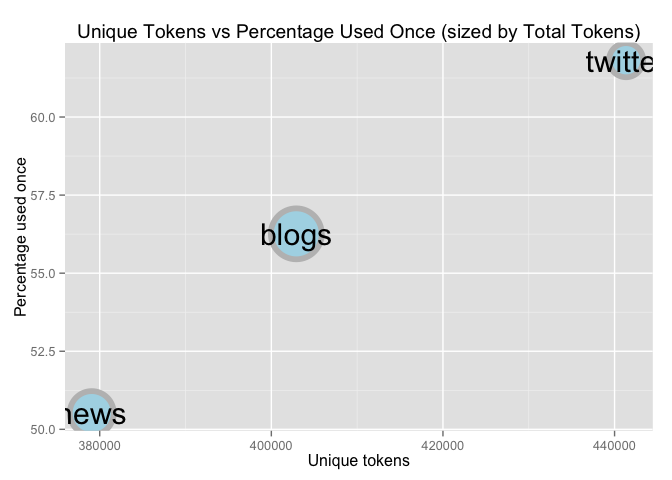

# Milestone


```
## 
## Attaching package: 'quanteda'
## 
## The following object is masked from 'package:base':
## 
##     sample
```

##Corpora Summary  


Before breaking down any text into *n*-grams or doing any natural language processing, we'll 
explore the texts just as they are provided to us. We have three corpora, namely: twitter; news; and
blogs. Here we see the number of texts in each corpus, along with the mean, median, and max 
characters per text.  


```
          Texts Average Median Maximum
twitter 2360148      69     64     140
news    1010242     201    185   11384
blogs    899288     230    156   40833
```

The average length of news and blogs are a bit higher than the medians. This skew is caused by some 
very long texts. The longest text in our corpora ia a blog, with more than 40 thousand characters. 
Note the 140 character limit on tweets.  

##Tokenizing  
The first step in building a language model is to **tokenize**, which involves break a sentence 
down into individual words, or pairs of words, or triplets of words, etc. These tokens are what we 
call *n*-grams, where *n* is the number of words. 

At this point we also make the decision to filter out whitespace and puncutation, and covert all 
text to lowercase. This makes for easier processing down the line, by having a more uniform set of 
texts. 


```
Non-UTF-8 encoding (possibly) detected  :windows-1252.
Non-UTF-8 encoding (possibly) detected  :windows-1252.
```

```

   ... indexing documents: 2,360,148 documents
   ... indexing features: 441,342 feature types
   ... created a 2360148 x 441342 sparse dfm
   ... complete. 
Elapsed time: 131.383 seconds.

   ... indexing documents: 1,010,242 documents
   ... indexing features: 379,069 feature types
   ... created a 1010242 x 379069 sparse dfm
   ... complete. 
Elapsed time: 132.352 seconds.

   ... indexing documents: 899,288 documents
   ... indexing features: 402,909 feature types
   ... created a 899288 x 402909 sparse dfm
   ... complete. 
Elapsed time: 138.689 seconds.
```

Let's take a look at the most frequent tokens of uni-grams (single words)


```
$twitter
   the     to      i      a    you    and    for     in     of     is 
936548 787265 722284 609331 547675 438150 385046 377938 359146 358702 
    it     my     on   that     me 
294722 291778 276997 234569 202301 

$news
    the      to     and       a      of      in     for    that      is 
1971527  901082  884895  875081  771072  674033  351163  346961  284107 
     on    with    said      he     was      it 
 266791  254722  250393  228946  228932  219703 

$blogs
    the     and      to       a      of       i      in    that      is 
1857795 1091883 1066175  897901  875281  773869  594142  460356  432391 
     it     for     you    with     was      on 
 403137  363234  298134  286504  278271  274392 
```

We see the top 15 tokens for twitter, news, and blogs. Most of the top features in all the corpora 
are words that help construct sentences, like "the", "and", "to", "a". The inclusion of "you" and
"me" highlight how conversational twitter is. The news seems more objective, with "said", "he", and "was" all in the top 15. The blogs corpus appears to be a cross between the other
two; containing both "you" and "was".

We see the unique list of uni-grams for each corpus:  

```
twitter    news   blogs 
 441342  379069  402909 
```

While twitter may have the largest number here, it's important to remember what we're looking at. 
There hasn't been any filtering yet, only tokenization. That means everything with a space on both
sides is considered a uni-gram here. That includes numbers, @mentions, misspellings, etc. In fact,
of twitter's 441342 terms, only 38% are used more than once. Here are the numbers for all the sets:

 

##Model Design  
To save space, we will not store all possible *n*-grams indexed by their *n-1*-grams. Instead, we 
only need to store the *n*-gram with the highest frequency of it's *n-1*-gram index. For instance, 
if we have a term frequency list as follows:  

Term    Frequency    index
------- ---------- --------
the box  .05        the  
the cat  .15        the  
the oven  .02       the  
the king  .01       the  

We will only store the highest frequency term for the given index, "the". In fact, we don't even
need the frequency at that point.  

Term     index
-------  --------
the box  the  


##Filtering  

Filtering, such as profanity and numbers, are done at the n-gram level, so we don't have sentences
with gaps


##Future Plans  
Plan to add a part of speech (POS) tagger for unseen n-grams. We'll create a small frequency list 
for each of the parts of speech (possibly trained on our data). Then instead of blindly returning 
the highest occuring token, we will return the highest occuring token given the POS.  

We will keep a small number of lines from each corpus as a test set. We can create lots of *n*-gram
samples from just a few lines to test our model.  

Don't use backoff only for grams that don't appear. IE Where is the n-1 gram more frequent? From 
that take the nth word for the model.  
